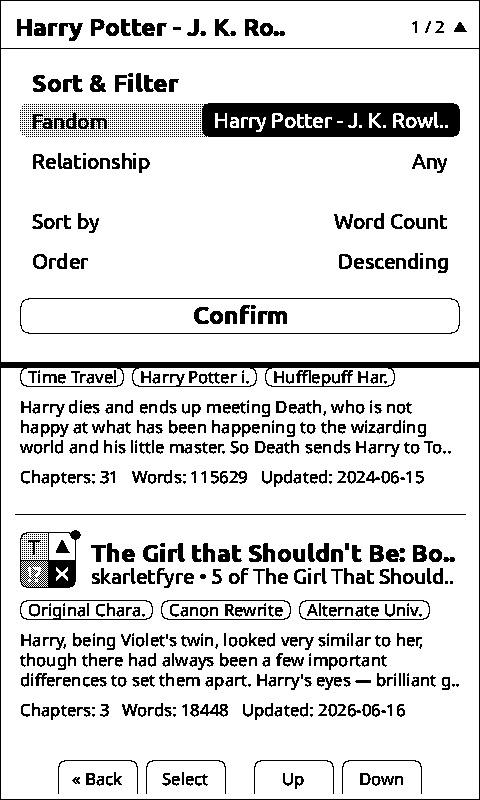
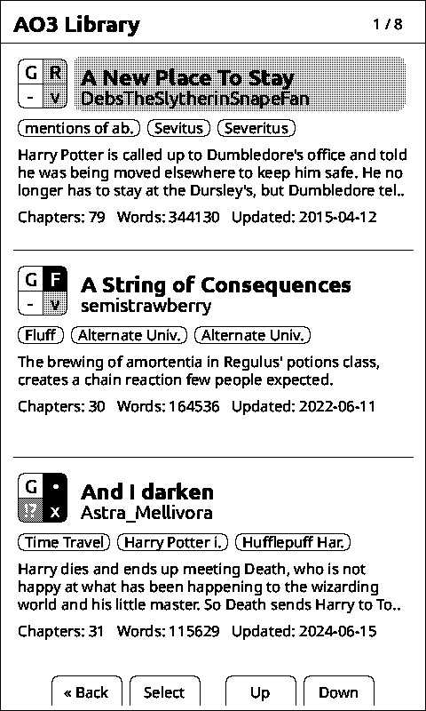
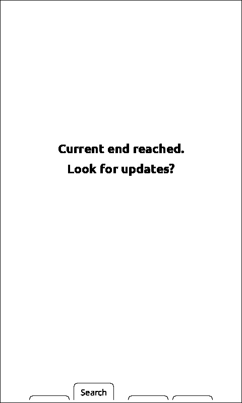
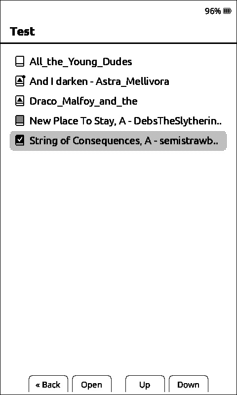
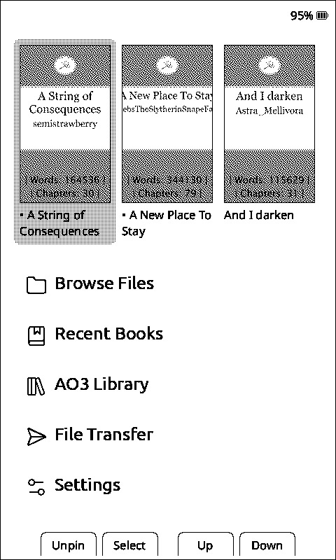

# What's Different in AvesO3
**Before flashing: ensure your device is UNLOCKED. Do not flash through the unlocker tool.**
- [x] AO3-style library browser, complete with summary and metadata square.
- [x] Download new chapters directly from AO3
- [x] Track the status of each fic directly from the File Browser (introduces 5 statuses, with a corresponding icon: Unread, Reading, Waiting for Chapter, New Chapter Available, Finished)
- [x] Pin your longfics to the homescreen, so they aren't pushed off by your oneshots
- [x] Added Noto Sans 10pt to replicate the experience of reading AO3 on a phone
- [x] Improved menu navigation: hold left/right to skip multiple lines in File Browser, Reader Menu and Homescreen
- [x] Support for line breaks

What's next:
- [x] AO3 Library sorting and filtering
- [ ] Auto index ao3 stories in chunks, so they don't need to be opened individually anymore
- [ ] Series continous reading
- [ ] Ao3 library fitlering based on folder structure as an option

What may come in the future:
- [ ] Locked fics support
- [ ] Online backend that can host your library online
- [ ] More!

# Progress on next version
**NEW - Automatic Sort and Filter**

<br>NOTE: THIS REQUIRES DELETING BOOK CACHE IF YOU PREVIOUSLY INDEXED BOOKS ON 1.2.2.
<br><br>Automatically Filter by: <br>
+ **Fandom**
+ **Relationship** (up to 2 relationships)<br><br> 

Sort by:<br>
+ **Title**
+ **Author**
+ **Word Count**
+ **Series**
+ **Date Added**<br><br>

**NAVIGATION:** 
+ **Down Button** opens the filter panel.
+ Inside the panel, **holding Next/Down** will bring you to the confirm button instantly.
<br clear="left"/> <br>

# Feature Showcase

**1. AO3-Style Library**


AO3-style library with summary and metadata, accessible from the Homescreen. 
In the AO3 square, the top right area has been changed to display the reading status (see point 3) instead of the relationship type. <br><br>
**Icon meaning:** <br>
\-    | Unread <br>
R     | Reading <br>
F     | Finished<br>
·     | Waiting for Chapter <br>
·     | (Black background) New Chapter Available <br> <br> 
**Navigation**: hold right/down and left/up to skip a page. <br><br>
**Warning:** in order for the stories to appear in this menu, they need to be opened **at least once**. 
<br clear="left"/> <br>

**2. Update Chapters On-Device**

<br><br>**New End of Book screen:** when the story is marked as in-progress, a new End of Book screen appears. While connected to wi-fi, pressing **Search** will start a story update check. If it's successfull, you can choose to download the updated story directly from AO3. <br><br>
**Warning:** locked fics are currently unsupported.
<br clear="left"/>

**3. File Browser Status Tracking**

<br><br>**Status tracking:** The epub icon now displays one of **5 new statuses**. <br><br>
**Icon Meaning:** <br>
White Book: Unread book<br>
▲ : Waiting for Chapter<br>
▲ with dot: New Chapter Available<br>
Grey Book: Currently reading<br>
Black with Checkmark: Finished reading<br>

**Note:** Statuses are assigned automatically. If you wish, you can also change them manually through the reader menu or by **long-pressing the Confirm Button** in the File Browser, the AO3 Library or the Reader Menu.
<br clear="left"/>

**4. Book Pinning**

<br><br>Pin your longfics to the Homescreen by pressing the **Back Button**, so they are never pushed off when you read oneshots.
<br><br>Pinned fics are marked with a **bullet dot [·]** before the title.
<br clear="left"/>

## Installing (UNLOCKED DEVICES ONLY!!!)

### Web (latest firmware)

1. Download the .bin file from the Releases section
2. Connect your Xteink X4 to your computer via USB-C and wake/unlock the device
3. Go to https://xteink.dve.al/ and click "Flash CrossPoint firmware"

To revert back to the official firmware, you can flash the latest official firmware from https://xteink.dve.al/, or swap
back to the other partition using the "Swap boot partition" button here https://xteink.dve.al/debug.

### Web (specific firmware version)

1. Connect your Xteink X4 to your computer via USB-C
2. Download the `firmware.bin` file from the release of your choice via the [releases page](https://github.com/crosspoint-reader/crosspoint-reader/releases)
3. Go to https://xteink.dve.al/ and flash the firmware file using the "OTA fast flash controls" section

To revert back to the official firmware, you can flash the latest official firmware from https://xteink.dve.al/, or swap
back to the other partition using the "Swap boot partition" button here https://xteink.dve.al/debug.

### Manual

See [Development](#development) below.

## Development

### Prerequisites

* **PlatformIO Core** (`pio`) or **VS Code + PlatformIO IDE**
* Python 3.8+
* USB-C cable for flashing the ESP32-C3
* Xteink X4

### Checking out the code

CrossPoint uses PlatformIO for building and flashing the firmware. To get started, clone the repository:

```
git clone --recursive https://github.com/crosspoint-reader/crosspoint-reader

# Or, if you've already cloned without --recursive:
git submodule update --init --recursive
```

### Flashing your device

Connect your Xteink X4 to your computer via USB-C and run the following command.

```sh
pio run --target upload
```
### Debugging

After flashing the new features, it’s recommended to capture detailed logs from the serial port.

First, make sure all required Python packages are installed:

```python
python3 -m pip install pyserial colorama matplotlib
```
after that run the script:
```sh
# For Linux
# This was tested on Debian and should work on most Linux systems.
python3 scripts/debugging_monitor.py

# For macOS
python3 scripts/debugging_monitor.py /dev/cu.usbmodem2101
```
Minor adjustments may be required for Windows.

## Internals

CrossPoint Reader is pretty aggressive about caching data down to the SD card to minimise RAM usage. The ESP32-C3 only
has ~380KB of usable RAM, so we have to be careful. A lot of the decisions made in the design of the firmware were based
on this constraint.

### Data caching

The first time chapters of a book are loaded, they are cached to the SD card. Subsequent loads are served from the 
cache. This cache directory exists at `.crosspoint` on the SD card. The structure is as follows:


```
.crosspoint/
├── epub_12471232/               # Each EPUB is cached to a subdirectory named `epub_<hash>`
│   ├── progress.bin             # Stores reading progress (chapter, page, etc.)
|   ├── ao3-info.bin             # Stores information for chapter syncing
|   ├── ao3-library-info.bin     # Stores information for displaying the AO3 Library
│   ├── cover.bmp                # Book cover image (once generated)
│   ├── book.bin                 # Book metadata (title, author, spine, table of contents, etc.)
│   └── sections/                # All chapter data is stored in the sections subdirectory
│       ├── 0.bin                # Chapter data (screen count, all text layout info, etc.)
│       ├── 1.bin                #     files are named by their index in the spine
│       └── ...
│
└── epub_189013891/
```

Deleting the `.crosspoint` directory will clear the entire cache. 

Due the way it's currently implemented, the cache is not automatically cleared when a book is deleted and moving a book
file will use a new cache directory, resetting the reading progress.

For more details on the internal file structures, see the [file formats document](./docs/file-formats.md).
---

CrossPoint Reader is **not affiliated with Xteink or any manufacturer of the X4 hardware**.

Huge shoutout to [**diy-esp32-epub-reader** by atomic14](https://github.com/atomic14/diy-esp32-epub-reader), which was a project I took a lot of inspiration from as I
was making CrossPoint.
